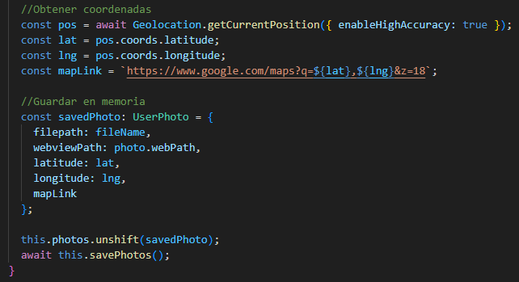

# Implementacion de una APK de fotos + ubicación donde fue tomada 

### 1. Instalar el Capacitor de Geolocalización

Se instala con el siguiente comando: npm install @capacitor/geolocation

### 2. Modificar location.ts

Este módulo se encargará de todo lo relacionado con el GPS. Se crea dentro de la carpeta app una carpeta llamada: services y dentro de esta el archivo location.ts

1. Primero, verifica si la aplicación tiene permiso para acceder a la ubicación y, si no los tiene, los pide.
2. Obtiene la posición GPS exacta en un momento específico.
3. Informa de cualquier cambio en la posición (útil para navegación en tiempo real).
4. Detiene el seguimiento cuando ya no es necesario. 

#### Código

### 3. Modificar photo.ts

Este módulo permite al usuario tomar una foto usando la cámara del celular. Después de tomarla, obtendrá las coordenadas GPS exactas de ese momento y genera un enlace a Google Maps con esa ubicación.

Guarda la imagen en la memoria del dispositivo (sistema de archivos) y luego añade todos los datos (la ruta de la foto, las coordenadas, el enlace) a una lista que se guarda en un archivo photos.json. También carga esa lista guardada cada vez que se inicia la aplicación. Además, permite eliminar una foto tanto de la lista en la aplicación como del archivo físico guardado en el dispositivo.

#### Código 

### 4. Modificar tab2.page.html 

En este código, el usuario podrá tomar la foto con un botón que le pedirá permiso para acceder a su ubicación y luego se creará una tarjeta para cada foto, cada una con el link de google maps que muestra la ubicación donde fue tomada la foto. 

#### Código

### 5. Demostración del funcionamiento de la APK

